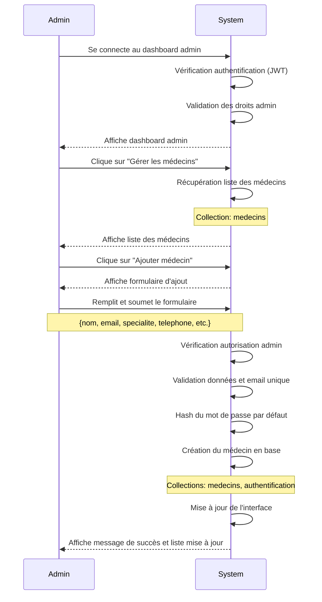
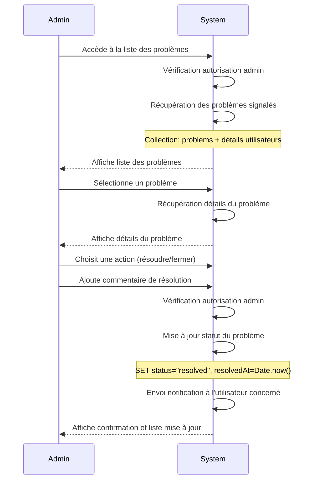
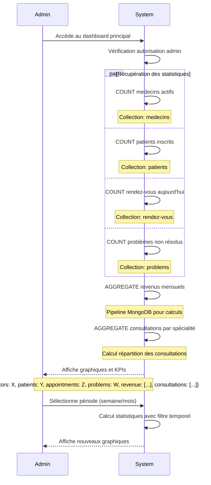
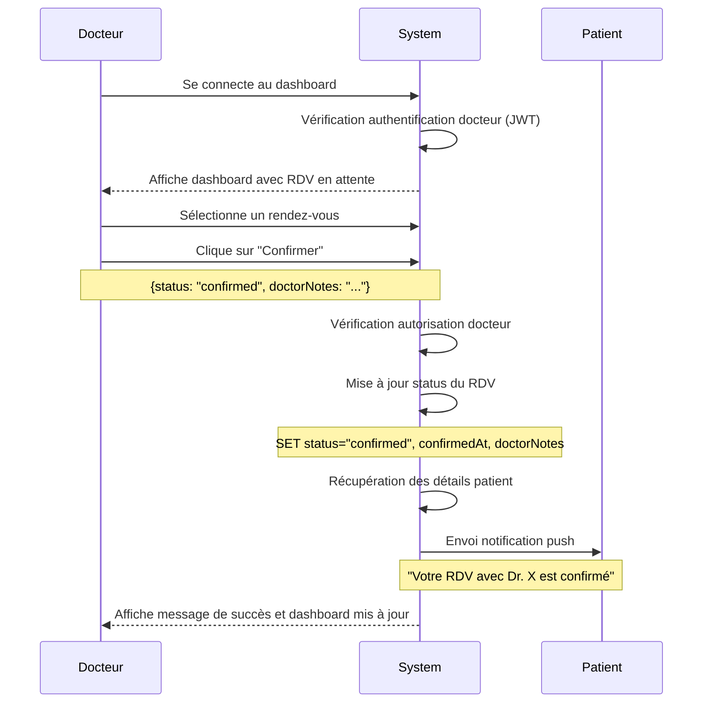
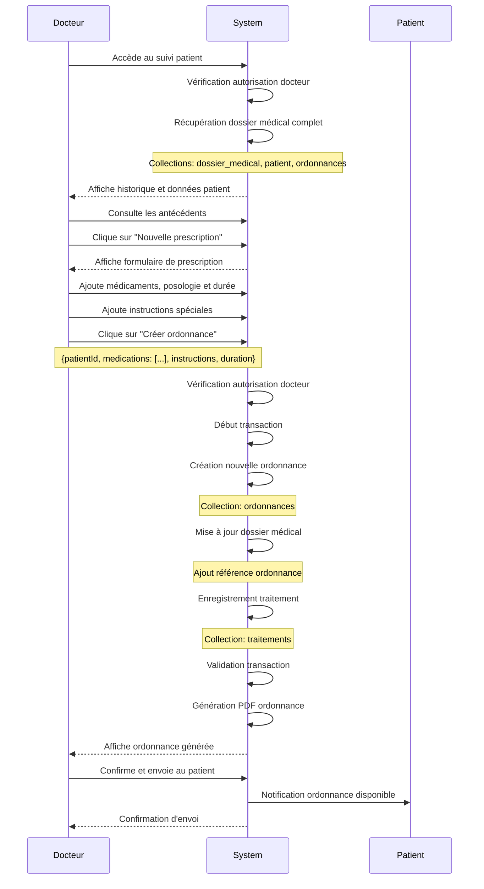
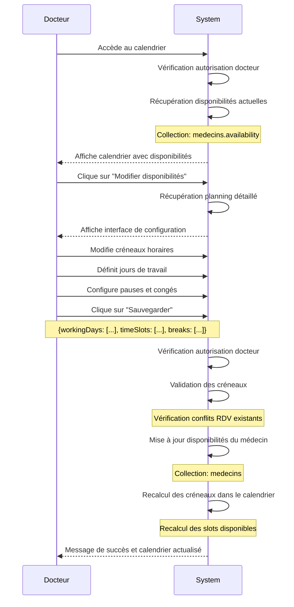
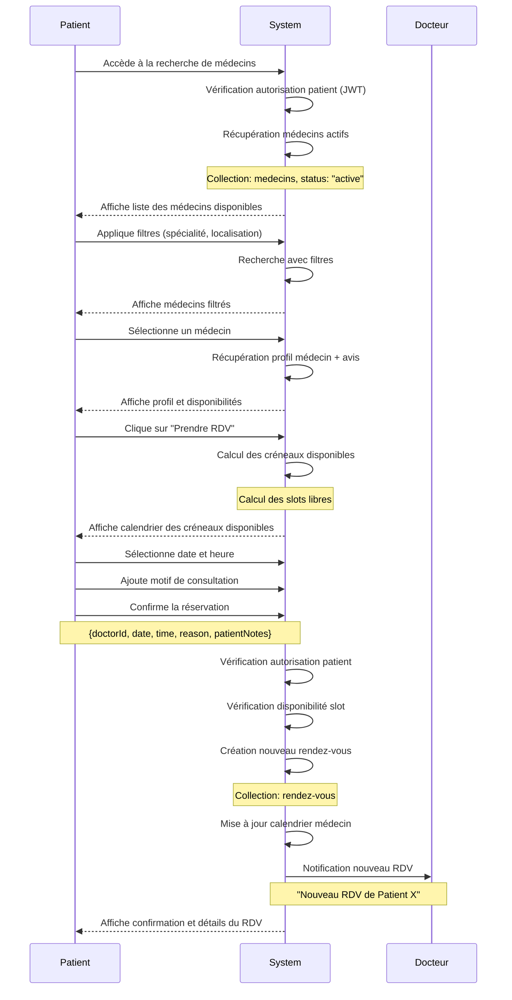
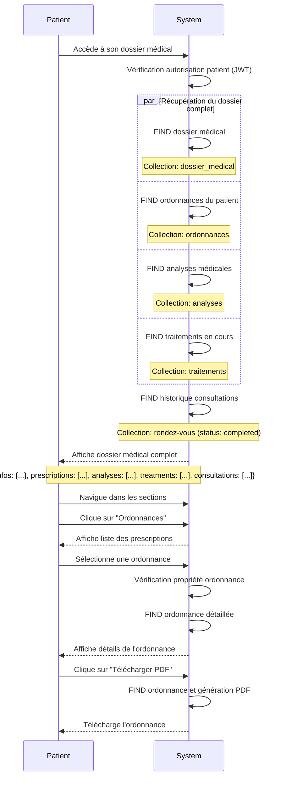
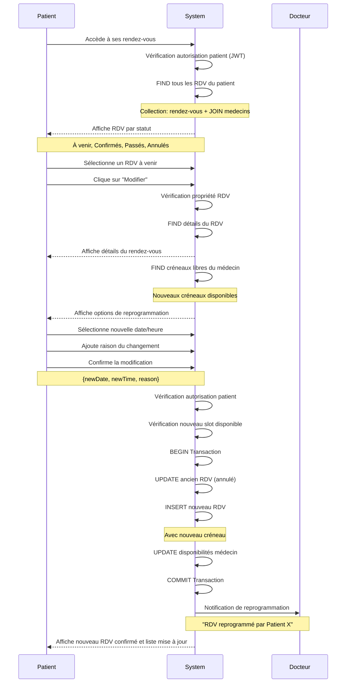
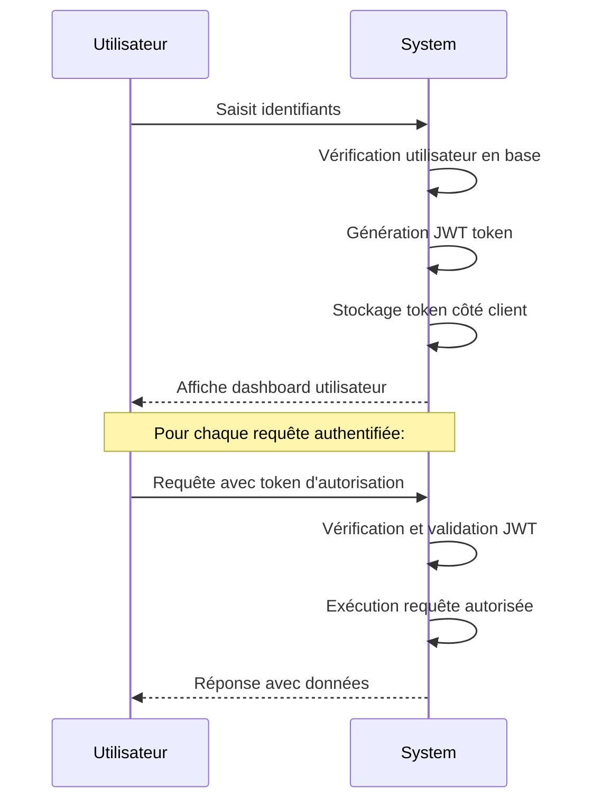

# Diagrammes de Séquence - Application MediX

## ADMIN - Scénarios Principaux

### 1. Gestion des Médecins - Ajout d'un nouveau médecin

### 2. Résolution de Problèmes - Traitement des signalements

### 3. Consultation des Statistiques - Monitoring de la plateforme

## DOCTEUR - Scénarios Principaux

### 1. Gestion des Rendez-vous - Confirmation d'un rendez-vous

### 2. Consultation Patient avec Prescription - Consultation complète

### 3. Configuration de Disponibilité - Gestion du calendrier

## PATIENT - Scénarios Principaux

### 1. Recherche et Prise de Rendez-vous - Booking complet

### 2. Consultation du Dossier Médical - Accès aux données médicales

### 3. Gestion des Rendez-vous - Suivi des appointments

## Architecture Technique Générale

### Authentification JWT

## Résumé des Fonctionnalités

### Points Clés de l'Architecture MediX

**🏗️ Architecture Simplifiée (2 acteurs) :**
- **Utilisateur** : Admin, Docteur ou Patient interagissant avec l'application
- **System** : Ensemble consolidé incluant :
  - Interface utilisateur (React Native)
  - Backend API (Express.js)
  - Base de données (MongoDB)
  - Authentification (JWT)
  - Notifications push
  - Génération de fichiers (PDF)

**🔐 Sécurité :**
- Authentification JWT pour tous les acteurs
- Autorisation basée sur les rôles (Admin, Docteur, Patient)
- Validation des données et vérification des propriétés

**📊 Fonctionnalités Principales :**
- **Admin** : Gestion des médecins, résolution de problèmes, statistiques
- **Docteur** : Confirmation RDV, prescriptions, gestion du calendrier  
- **Patient** : Recherche médecins, prise de RDV, dossier médical

**💾 Gestion des Données :**
- Transactions MongoDB pour l'intégrité des données
- Collections : medecins, patients, rendez-vous, ordonnances, problems
- Génération de PDF pour les ordonnances
- Système de notifications push entre utilisateurs

**🔄 Flux Simplifiés :**
Tous les diagrammes montrent désormais une architecture à 2 acteurs uniquement :
- L'**Utilisateur** (Admin/Docteur/Patient) qui initie les actions
- Le **System** qui traite toutes les opérations (interface, logique métier, stockage)

Cette simplification permet une meilleure lisibilité des processus métier tout en conservant la complexité technique nécessaire dans les notes explicatives.
